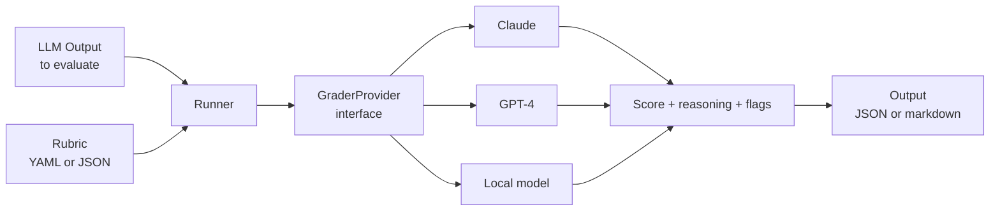

# pm-eval

> A provider-agnostic eval harness for grading LLM and agent output against rubrics — built on the principle that the judge model should be as swappable as the model being judged.

This repo implements the **Evaluation** rung of [The PM Scaffold](https://github.com/nich9000/pm-scaffold) — a framework for product management work in the agentic era. See the [framework repo](https://github.com/nich9000/pm-scaffold) for the four-rung thesis and roadmap.

---

## Why this exists

Without evaluation, every other rung's improvements are vibes. The Specs rung claims to produce better specs — how do you know? The Orchestration rung claims to produce more reliable workflows — measured against what? Evaluation is what turns *"I think this works"* into *"I can show this works, on these dimensions, repeatedly."*

Most public eval tooling is locked to a single provider. That's a violation of the framework's core thesis: structure outlasts tooling. A judge model is a tool — the rubric and the rigor are the structure. `pm-eval` is provider-agnostic by design.

## The provider-agnostic claim

`pm-eval` treats the judge model as a swappable implementation behind a stable interface. The rubric is the contract; the model is incidental. Concretely:

- The same `spec-quality.yaml` rubric runs against Claude, GPT-4, Gemini, or a local Ollama model.
- Switching judge models is a one-line config change, not a rewrite.
- A future model (or one that doesn't exist yet) drops in by implementing a single `GraderProvider` interface.

This matters because the model layer changes faster than the rubric layer. Rubrics, written well, can outlive several generations of judge models. The harness should outlive them too.

## How it works



A rubric is a structured prompt template. The runner pairs the rubric with the LLM output you want graded, hands it to whichever provider you've configured, and emits a structured result you can store, diff, and regression-test against.

## Install

```bash
pip install pm-eval                    # once published; for now, install from source
git clone https://github.com/nich9000/pm-eval
cd pm-eval
pip install -e .
```

## Quick example

```bash
# Grade a spec against the spec-quality rubric using Claude as judge
pm-eval grade \
  --input examples/sample_spec.md \
  --rubric rubrics/spec-quality.yaml \
  --provider anthropic

# Same rubric, different judge — no other changes
pm-eval grade \
  --input examples/sample_spec.md \
  --rubric rubrics/spec-quality.yaml \
  --provider openai

# Run a regression suite over many outputs
pm-eval suite --inputs ./outputs/ --rubric rubrics/spec-quality.yaml
```

```python
from pm_eval import Grader
from pm_eval.providers import ClaudeProvider

grader = Grader(provider=ClaudeProvider(), rubric="rubrics/spec-quality.yaml")
result = grader.grade(open("examples/sample_spec.md").read())

print(result.score)              # 0.0 - 1.0 (or whatever the rubric defines)
print(result.dimensions)         # per-dimension scores
print(result.failures)           # specific failure modes the rubric catches
print(result.reasoning)          # judge's explanation
```

## Rubric library

Reference rubrics live in `rubrics/`. They're tuned for PM-AI scenarios but the format is generic.

| Rubric | Grades |
|---|---|
| `spec-quality.yaml` | Specifications: ambiguity, completeness, testability, EARS-conformance |
| `summary-fidelity.yaml` | Summaries: faithfulness, coverage, no-hallucination |
| `recommendation-safety.yaml` | Recommendation outputs: clinical-claim safety, regulatory exposure, bias |
| `prd-completeness.yaml` | PRDs: framing, story coverage, risk articulation, metrics specificity |

Bring your own rubric: rubrics are YAML files with a documented schema. Write one for your domain in 10 minutes.

## Provider support

| Provider | Status | Models |
|---|---|---|
| Anthropic | Live | Claude 4.5/4.6 family |
| OpenAI | Live | GPT-4o, o-series |
| Local (Ollama) | Live | Any Ollama-compatible model |
| Google Gemini | Roadmap | — |
| Adding your own | One file | Implement the `GraderProvider` interface |

## Why "judge as a swappable tool" matters

The same eval can give different scores depending on the judge. That's not a bug — it's signal. Running the same rubric across multiple judges gives you:

- **Consensus signal** — outputs all judges agree are good are probably good.
- **Disagreement signal** — outputs judges disagree about are worth a human look.
- **Drift detection** — when a model upgrade changes scores on stable rubrics, you have measurable evidence of behavior change.

Provider lock-in robs you of all three.

## Status

V0 — repo skeleton with thesis, architecture, and rubric stubs. Core implementation, provider adapters, and the rubric library are being built across the next several iterations. Watch the repo for updates, or open an issue if you want to be notified when v0.1 ships.

## Roadmap

- v0.1 — Core grader + Anthropic provider + first three reference rubrics
- v0.2 — OpenAI and local Ollama providers
- v0.3 — Suite runner with regression tracking
- v0.4 — Cost-per-quality-point tracking, judge-disagreement reports
- v1.0 — Stable schema, comprehensive rubric library, plugin architecture for custom providers

## Built from

A private precursor: an eval harness was prototyped to score job-application generation pipelines on dimensions like specificity, narrative coherence, and JD-match accuracy. `pm-eval` extracts and generalizes that pattern.

## License

[MIT](./LICENSE).
